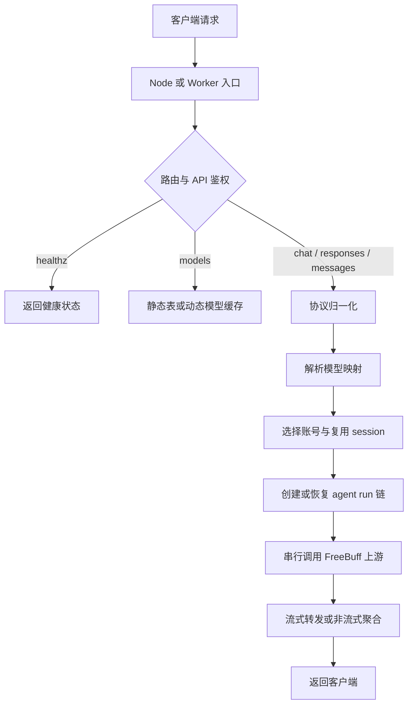

# FreeBuff2API

<p align="center">
  
</p>

[](LICENSE)
[](https://github.com/wintopic/FreeBuff2API/actions/workflows/quality.yml)
[](https://nodejs.org/)
[](#api-与调用示例)
[](https://github.com/wintopic/FreeBuff2API)

一个本地优先的 FreeBuff 模型兼容网关。

FreeBuff2API 把 FreeBuff 的 session、agent-runs 和流式上游请求整理成 OpenAI-compatible API，同时提供 Anthropic Messages 适配层。项目支持多账号轮换、活跃 session 复用、动态模型表、健康检查，以及面向 Windows 小白用户的可选图形启动器。

> 项目与 FreeBuff、Codebuff、OpenAI、Anthropic 或任何模型提供方没有隶属关系。本项目用于协议研究、兼容性测试和个人学习，请遵守上游服务条款，只使用你有权使用的账号和凭据。

## 📚 文档导航

- [快速开始](#快速开始)
- [Windows 图形启动器](#windows-图形启动器)
- [配置与代理](#配置与代理)
- [API 与调用示例](#api-与调用示例)
- [实现原理](#实现原理)
- [模型与额度](#模型与额度)
- [部署方式](#部署)
- [故障排查](#故障排查)
- [开发与质量](#开发与质量)
- [安全说明](SECURITY.md)

本地部署是默认建议。它更容易控制出口代理、日志、凭据权限和升级时机，也不会自动暴露 Cloudflare Worker 的边缘请求标记。

## ✨ 特性

- ⭐ **动态模型映射**：定期解析 FreeBuff 公共源码，并用仓库快照和内置表兜底
- 🔒 **常规模型基础额度**：除上述两个特殊模型外，普通模型按每日 6 次 session 的基础额度理解；不会宣传为无限量
- 🔁 **多账号自动切换**：撞额度自动冷却并切换，逗号分隔即可
- 💡 **优先复用活跃 session**：一个 session 约 1 小时有效，创建 session 才扣额度；只要当前模型的 session 还活跃就钉在同一账号上，用满再换，最大化额度利用率
- 📢 **广告与 streak 流程兼容**：创建新 session 前，Worker 会按官方客户端流程请求广告，并调用 `GET /api/v1/freebuff/streak` 尝试签到；相关请求失败会静默跳过，不阻塞聊天
- 🧩 **OpenAI 兼容**：`/v1/models`、`/v1/chat/completions`、`/v1/responses`（流式/非流式视接口支持情况而定）
- 📨 **Anthropic Messages API**：支持 `/v1/messages`、`/messages` 及对应的 `count_tokens` 路由，可供 Anthropic SDK / 兼容客户端尝试接入
- ❤️ **健康检查**：`GET /healthz`（免鉴权），方便监控探活
- 📦 **核心协议单文件**：业务逻辑集中在 `worker.js`，Node、Docker、GUI 与 Cloudflare Worker 共用

### 架构概览

```text
OpenAI SDK / Anthropic SDK / 常见客户端
                    │
                    ▼
          FreeBuff2API 兼容网关
       鉴权 · 协议转换 · 账号选择
       session · agent-runs · 流式转发
                    │
                    ▼
       FreeBuff / Codebuff 上游服务
```

核心协议逻辑集中在 `worker.js`。`server.js` 使用 Node 原生 HTTP 服务把请求转换为标准 Web Request，再调用同一个 `fetch` 入口。因此 Node、本地 GUI、Docker 与 Cloudflare Worker 可以共享业务实现。

## 📨 Anthropic Messages API 支持

主代码已加入 Anthropic Messages API 适配，当前支持：

- `POST /v1/messages`
- `POST /messages`
- `POST /v1/messages/count_tokens`
- `POST /messages/count_tokens`
- Anthropic 消息格式转换为 Worker 内部使用的 OpenAI-compatible 请求
- 文本消息、`tool_use` / `tool_result`、`tool_choice`
- 非流式响应和 Anthropic SSE 流式响应
- Anthropic 风格的错误响应

> ⚠️ **测试说明**：当前项目维护者没有实际使用 Anthropic Messages API 的客户端环境，因此暂未完成真实 Anthropic 客户端的端到端测试。主代码和本地 stub / 回归测试已经处理并验证转换逻辑，但不代表所有 Anthropic SDK、工具调用组合和客户端行为都已覆盖。
>
> 如果你有 Anthropic Messages API 的实际使用场景，欢迎在不影响现有 OpenAI API 线路的前提下进行测试，并反馈请求格式、流式响应、工具调用或模型兼容性问题。反馈时请尽量附上脱敏后的请求结构、响应状态码和错误信息。
>
> Anthropic API 是新增的协议适配层，不改变现有 OpenAI `/v1/chat/completions`、`/v1/responses`、账号轮换、session 生命周期和 Freebuff 主调用链。

## ⭐ 特殊模型：DeepSeek V4 Flash 与 MiMo 2.5

FreeBuff Desktop 在完整模式下将下面两个模型归入 **unlimited 非 Premium 类别**。这里的 `unlimited` 主要表示模型分类和并发类别，**不是对所有账号、地区、接口和时间都作绝对无限量保证**。本地部署是否进入完整模式由实际出口和账号状态决定：

| 模型 | 完整模式下的说明 |
|---|---|
| `deepseek/deepseek-v4-flash` | 官方非 Premium 模型；主力推荐，当前 Worker 探测未显示基础日限额 |
| `mimo/mimo-v2.5` | 官方非 Premium 模型；当前 Worker 探测未显示基础日限额 |

> ⚠️ 受限模式可能对 DeepSeek V4 Flash 和 MiMo 2.5 设置 session 上限。最终可用性和实际额度以 FreeBuff 上游返回为准，官方规则也可能调整。

除这两个特殊模型外，普通模型统一按 **每日 6 次基础 session / 太平洋日** 理解（北京时间约 15:00 重置）。`referral`、`streak`、独立共享池和上游临时限制属于额外条件，不能据此宣传为无限量。

> 💡 **关于额度**：额度通常按「创建 session」计算。活跃 session 内的多轮对话可以复用同一 session，实际规则以账号和上游返回为准。
>
> 📝 **广告与 streak 说明**：创建新 session 前，Worker 会按官方客户端流程请求广告，并调用 `GET /api/v1/freebuff/streak` 尝试签到。连续使用是否获得额外额度、额度增加多少，由 freebuff 官方服务端决定；该流程不是额度保证，也不会改变 session 本身的扣额度规则。

## 快速开始

本地无 Docker 方式需要 Node.js 24。Node 24 提供 `--use-env-proxy`，可直接读取 `.env` 中的本机代理设置。

```powershell
git clone https://github.com/wintopic/FreeBuff2API.git
Set-Location FreeBuff2API
Copy-Item .env.example .env
```

编辑 `.env`，设置随机的 `FREEBUFF_API_KEY` 和本机代理地址。随后完成登录并启动服务：

```powershell
.\login-freebuff.ps1
.\start-local.ps1
```

脚本会把服务隐藏到后台运行，不显示 Node 终端。停止服务时运行：

```powershell
.\stop-local.ps1
```

也可以直接运行 Node：

```powershell
node --use-env-proxy --env-file=.env server.js
```

启动完成后检查：

```powershell
Invoke-RestMethod http://127.0.0.1:8877/healthz
```

客户端填写：

| 字段 | 值 |
|---|---|
| Base URL | `http://127.0.0.1:8877/v1` |
| API Key | `.env` 中的 `FREEBUFF_API_KEY` |

## Windows 图形启动器

仓库包含可选的 WinForms 启动器源码，位于 [`launcher`](launcher)。它面向不想接触终端的 Windows 用户，提供一键启动/停止、浏览器登录、代理检测、复制接入信息和隐藏 Node 控制台等功能。新 Logo、窗口图标和任务栏图标也由启动器工程统一生成。

启动器的运行数据保存在程序目录下的 `runtime`，其中 `.env`、`credentials` 和 `logs` 必须保持本地私有。仓库只应提交启动器源码与图标资源，不应提交 Node 二进制、发布目录或账号凭据。

构建条件：Windows 10 或更高版本、.NET 9 SDK。先运行准备脚本，它会从 Node.js 官方站下载最新 Node 24 Windows x64 运行时并校验 SHA-256：

```powershell
.\scripts\prepare-launcher-runtime.ps1

dotnet publish launcher/FreeBuffLauncher.csproj `
  -c Release `
  -r win-x64 `
  --self-contained true `
  -o dist/FreeBuff桌面助手
```

生成目录需要保持 `FreeBuff桌面助手.exe` 与 `runtime` 文件夹在一起。应用本身是 `WinExe`，双击运行不会弹出终端窗口。

仓库中的 `Build Windows launcher` 工作流也可以手动生成下载 artifact；推送 `v*` 版本标签时会自动把 zip 附加到对应 GitHub Release。Node 二进制只进入构建产物，不进入 Git 历史。

## 配置与代理

复制 [`.env.example`](.env.example) 为 `.env` 后按需修改。最小配置示例：

```dotenv
PORT=8877
HOST=127.0.0.1
FREEBUFF_API_KEY=change-this-local-key
FREEBUFF_DEBUG=false
HTTP_PROXY=http://127.0.0.1:3067
HTTPS_PROXY=http://127.0.0.1:3067
ALL_PROXY=http://127.0.0.1:3067
NO_PROXY=127.0.0.1,localhost
NODE_USE_ENV_PROXY=1
DOCKER_PROXY=http://host.docker.internal:3067
```

`FREEBUFF_API_KEY` 是客户端访问本地网关的 key，`FREEBUFF_TOKEN` 是网关访问 FreeBuff 上游的账号凭据，两者不能互换。免费模型通常要求美国出口，代理端口能连通也不等于出口已经满足上游地区策略。

服务默认监听 `127.0.0.1`。只有在确实需要局域网访问时才改为 `0.0.0.0`，并配合防火墙限制来源。

> 🌐 **自定义域名**：如果 `*.workers.dev` 域名访问不通（部分地区被墙/受限），可给 Worker 绑定自己的域名，Base URL 改为 `https://你的域名/v1`。配置方法见下方「[自定义域名](#-自定义域名)」。

## ❤️ 健康检查

部署后可用，**无需 API key**：

```bash
curl http://127.0.0.1:8877/healthz
# {"status":"ok","version":"1.8.9","accounts":2,"time":"..."}
```

- `version` 用于确认正在运行的 Worker 逻辑版本
- `accounts` 表示已加载的账号数量，不会返回 token
- 适合接入 UptimeRobot / 自建监控探活

## 🔑 获取 FREEBUFF_TOKEN

freebuff 登录凭证（authToken）通过官方 CLI 同款**授权码轮询**获取。项目自带提取工具 `freebuff_tools/extract_freebuff.py`，交互方式与 `cline_oauth.py` 一致。

### 方式 A：GitHub Actions 工作流（推荐，远程提取）

仓库自带工作流 `.github/workflows/extract-token.yml`，在 GitHub Actions 里跑提取，授权链接和 token 只发到你的 Telegram，日志全程掩码（`::add-mask::`），不泄露敏感信息。

**第一步：配置 Secrets**（仓库 Settings → Secrets and variables → Actions）：

| Secret | 说明 |
|---|---|
| `TG_BOT_TOKEN` | Telegram bot token（找 @BotFather 创建，如 `123456:ABC-xxx`） |
| `TG_CHAT_ID` | 你的 Telegram 数字 chat id（给 @userinfobot 发消息获取） |

**第二步：运行工作流**：

1. 仓库页面 → **Actions** → 左侧 **获取 Freebuff authToken** → **Run workflow**
2. 可选填 `poll_timeout`（授权等待秒数，默认 300）和 `fingerprint`（留空自动生成）
3. 你的 TG 会收到登录链接，浏览器打开并登录 Google 账号
4. 脚本轮询到 token 后，完整 token 直接发到你 TG（Actions 日志里只有 `***`）
5. 跑完自动清理旧运行记录，只保留最新 1 条

> 没配 `TG_BOT_TOKEN` / `TG_CHAT_ID` 时工作流第一步直接失败，不会执行提取。

### 方式 B：本地提取

```bash
cd freebuff_tools
python3 extract_freebuff.py login   # 打印授权 URL 到终端，浏览器授权后自动轮询
python3 extract_freebuff.py show    # 显示全部账号：邮箱 + token + 存活状态 + 汇总一行一个
python3 extract_freebuff.py tgsend  # 测试 TG 连通性（配了 TG 时用）
```

本地运行 `login` 时，每个账号会**分键追加**保存到 `freebuff_tools/freebuff_credentials.json`（不覆盖已有账号，支持 Google / GitHub 登录，均自动记录）。该文件已被 `.gitignore` 忽略，不会提交到 GitHub；结构参考 `freebuff_tools/freebuff_credentials.example.json`。

其他实用命令：

```bash
python3 extract_freebuff.py export           # 汇总全部账号 token，一行一个，直接复制进 CF Workers 变量
python3 extract_freebuff.py quota            # 查用量
python3 extract_freebuff.py session          # 开/查 session
python3 extract_freebuff.py chat "你好"      # 发一条消息测试模型 API
```

> 💡 `show` 内部用 `GET /api/v1/freebuff/session` 探测每个账号（**不创建 session、0 消耗**），一次显示全部状态：存活 + 额度 / token 失效 / 被封禁 / 地区受限 / 额度用完。官方对 banned 账号会在所有接口返回 `status: banned`。多账号时 `export` 输出的每行 token 直接粘贴到 Cloudflare Worker 变量 `FREEBUFF_TOKEN`（换行分隔）即可。

## 部署

### Docker 容器化部署

> 适合 NAS、VPS 和长期运行场景。仓库默认从源码构建本地镜像，不依赖第三方镜像发布是否及时。

---

#### 方式一：一键 `docker run`（最快）

```bash
# 1. 准备 credentials/freebuff_credentials.json（多账号聚合格式）
#    用提取工具生成：python3 freebuff_tools/extract_freebuff.py login
#    或手动创建：{"accounts": {"<账号id>": {"email": "...", "authToken": "...", "name": "..."}}}

# 2. 构建镜像并启动
docker build -t freebuff2api:local .

docker run -d --name freebuff2api --restart unless-stopped \
  -p 8877:8787 \
  --add-host host.docker.internal:host-gateway \
  -e PORT=8787 \
  -e HOST=0.0.0.0 \
  -e FREEBUFF_API_KEY=your-api-key \
  -e NODE_USE_ENV_PROXY=1 \
  -e HTTP_PROXY=http://host.docker.internal:3067 \
  -e HTTPS_PROXY=http://host.docker.internal:3067 \
  -v "$(pwd)/credentials:/app/credentials:ro" \
  freebuff2api:local
```

变量多时也可以用 `.env` 文件（`docker run --env-file .env`）：

```bash
cat > .env <<'EOF'
PORT=8787
HOST=0.0.0.0
FREEBUFF_API_KEY=your-api-key
NODE_USE_ENV_PROXY=1
HTTP_PROXY=http://host.docker.internal:3067
HTTPS_PROXY=http://host.docker.internal:3067
EOF

docker run -d --name freebuff2api --restart unless-stopped \
  -p 8877:8787 \
  --add-host host.docker.internal:host-gateway \
  --env-file .env \
  -v "$(pwd)/credentials:/app/credentials:ro" \
  freebuff2api:local
```

---

#### 方式二：docker compose（推荐长期运行）

```bash
cp .env.example .env
# 编辑 .env 中的 FREEBUFF_API_KEY
docker compose up -d --build
```

> 💡 Compose 会通过 `env_file` 把 `.env` 中的 API key 和调试开关传进容器，并用 `DOCKER_PROXY` 覆盖容器代理。不要给容器使用 `127.0.0.1:3067`，因为它指向容器本身；默认的 `host.docker.internal:3067` 指向宿主机。Compose 同时强制容器内部监听 `0.0.0.0:8787`，宿主机仍通过 `127.0.0.1:8877` 访问。

**凭据文件：** 启动前/后放入账号凭据，放入后重启容器生效：

```bash
chmod 600 credentials/freebuff_credentials.json
# 多账号格式：{"accounts": {"<账号id>": {"email": "...", "authToken": "...", "name": "..."}}}
docker compose restart          # 或 docker restart freebuff2api
```

---

#### 更新方式

镜像默认使用构建时打包的 `worker.js`。重新构建可以同步 Dockerfile、server.js 和其他运行文件。维护者也可以显式设置 `WORKER_URL` 启用容器引导器模式，启动时拉取指定的 `worker.js`，拉取失败仍使用镜像内置副本。

```bash
docker compose up -d --build                  # 重新构建并启动
docker compose restart                        # 使用现有镜像重启
```

#### 环境变量

| 变量 | 说明 |
|---|---|
| `PORT` / `HOST` | 监听端口/地址，默认 `8787` / `0.0.0.0` |
| `FREEBUFF_API_KEY` | 本 API 访问 key；请改为随机值，不要使用缺省 key |
| `FREEBUFF_DEBUG` | `true` 开启请求级调试日志 |
| `HTTP_PROXY` / `HTTPS_PROXY` / `ALL_PROXY` | 本地 Node.js 使用的上游出口代理；Compose 会改用 `DOCKER_PROXY` |
| `NO_PROXY` | 不走代理的地址，通常为 `127.0.0.1,localhost` |
| `DOCKER_PROXY` | Compose 专用的宿主机代理地址，默认示例为 `http://host.docker.internal:3067` |
| `WORKER_URL` | 可选；仅显式设置时在容器启动阶段拉取远程 `worker.js` |

> ⚠️ 容器内 `freebuff_credentials.json` 以只读方式挂载；`server.js` 启动时读取并组装 `FREEBUFF_TOKEN`（多账号逗号分隔）。`server.js` 兼容两种格式：多账号聚合 `{"accounts": {...}}`（提取工具默认输出）和单账号顶层 `authToken`。

#### 维护者发布镜像

仓库已配置 `.github/workflows/docker-publish.yml`（手动触发，多架构 amd64/arm64）。在 GitHub Secrets 配置 `DOCKERHUB_USERNAME` 与 `DOCKERHUB_TOKEN` 后，到 Actions 页面手动 **Run workflow** 即可发布新镜像。

### Cloudflare Worker 部署

> **Freebuff 官方已检测 Cloudflare Worker 部署**（识别 `cf-worker` / `cf-ray` 等边缘标记，源码中已点名类似本项目的代理模式）。在 CF 上部署会显著增加账号被封禁的风险，**不推荐作为主要部署方式**；以下步骤仅保留给熟悉风险的用户参考。

worker 是**单文件**（`worker.js`），如仍需在 CF 部署：

### 方式 A：CF 控制台粘贴代码

最简单可控，不依赖本地环境、不关联 GitHub：

1. 打开 [dash.cloudflare.com](https://dash.cloudflare.com) → **Workers & Pages** → **创建** → **创建 Worker**
2. 名称随意（如 `freebuff2api`），点击 **部署**
3. 进入该 Worker → **编辑代码** → 把 [worker.js](worker.js) 的**全部内容**粘贴进去，覆盖默认代码 → **部署**
4. 点 **设置 → 变量和机密 → 添加**：

   | 类型 | 名称 | 值 |
   |---|---|---|
   | 机密 | `FREEBUFF_TOKEN` | 你的 freebuff token（多账号用英文逗号分隔） |
   | 机密 | `FREEBUFF_API_KEY` | 自定义访问 key（可选，不设则用 `freebuff-default-key`） |

5. 部署完成后访问验证：

   ```bash
   curl https://你的worker.workers.dev/healthz          # 健康检查（无需 key）
   curl https://你的worker.workers.dev/v1/models \
     -H "Authorization: Bearer ***"           # 模型列表
   ```

> 每次改代码只需重复第 3 步：编辑代码 → 粘贴新内容 → 部署。**不推荐关联 GitHub 自动部署**（见下文）。
> ⚠️ **版本约定**：每次部署前务必把代码里的版本号（healthz 的 `version` 字段 + `X-Freebuff2api-Version` 响应头）升一档，否则无法确认线上是否已更新。

### 关联 GitHub 自动部署

虽然 CF 支持连接 GitHub 仓库自动部署，但**不建议用**：

- 每次 push 都会触发上线，本地未验证的改动可能直接打到线上
- 需要额外配置构建命令/根目录，仓库里的 `freebuff_tools/` 等辅助文件也会被拉取
- secrets 与分支状态容易混乱，出问题不好排查
- 本仓库含 token 提取脚本，自动同步增加暴露面

**推荐做法**：本地改代码 → Docker 容器/自建 VPS 部署，或（了解风险的前提下）手动粘贴到 CF 控制台 → 自己点部署，完全可控。

> 免费模型对出口 IP 有 US 限制，Cloudflare Workers 默认美国出口，无需额外配置。

### 🌐 自定义域名

默认域名 `https://你的worker名.你的子域.workers.dev` 在部分地区可能访问不通（如被墙/GFW 限制）。如果遇到 `workers.dev` 连接超时或无法访问，可以给 Worker 绑定自己的域名：

1. **添加自定义域**：CF 控制台 → 你的 Worker → **设置 → 域和路由** → **添加** → **自定义域**
2. 输入你的域名（如 `api.你的域名.com`），CF 会自动引导添加 DNS 记录（CNAME 指向 `你的worker名.你的子域.workers.dev`）
3. 等待 DNS 生效（一般几分钟），自动签发免费 SSL 证书
4. 之后 Base URL 改为：`https://api.你的域名.com/v1`

> 要求：域名必须托管在 Cloudflare（或把 DNS 转到 CF）。workers.dev 子域无需配置，绑定自定义域只是给访问不通的地区多一条可用路径。

## API 与调用示例

### 路由总览

| 方法 | 路径 | 鉴权 | 说明 |
|---|---|---|---|
| `GET` | `/healthz` | 否 | 本地或监控探活，不创建上游 session |
| `GET` | `/v1/models` | 是 | 返回静态/动态模型映射 |
| `POST` | `/v1/chat/completions` | 是 | OpenAI Chat Completions，支持流式 |
| `POST` | `/v1/responses` | 是 | OpenAI Responses 适配 |
| `POST` | `/v1/messages` | 是 | Anthropic Messages 适配 |
| `POST` | `/v1/messages/count_tokens` | 是 | Anthropic token 计数兼容入口 |

同一组业务路由也兼容不带 `/v1` 的路径。具体字段支持取决于上游模型和客户端组合，复杂工具调用建议先用隔离账号验证。

```bash
# 健康检查
curl http://127.0.0.1:8877/healthz

# 模型列表
curl http://127.0.0.1:8877/v1/models \
  -H "Authorization: Bearer <API_KEY>"

# 非流式
curl http://127.0.0.1:8877/v1/chat/completions \
  -H "Authorization: Bearer <API_KEY>" -H "Content-Type: application/json" \
  -d '{"model":"deepseek/deepseek-v4-flash","messages":[{"role":"user","content":"你好"}]}'

# 流式
curl -N http://127.0.0.1:8877/v1/chat/completions \
  -H "Authorization: Bearer <API_KEY>" -H "Content-Type: application/json" \
  -d '{"model":"deepseek/deepseek-v4-flash","messages":[{"role":"user","content":"你好"}],"stream":true}'
```

### OpenAI Responses

Responses 请求会先把 `input`、`instructions` 和消息条目转换成内部 chat 消息，再沿用相同的账号、session 和 run 链路。

```bash
curl http://127.0.0.1:8877/v1/responses \
  -H "Authorization: Bearer <API_KEY>" \
  -H "Content-Type: application/json" \
  -d '{"model":"deepseek/deepseek-v4-flash","input":"解释什么是 HTTP 反向代理"}'
```

### Anthropic Messages

```bash
curl http://127.0.0.1:8877/v1/messages \
  -H "x-api-key: <API_KEY>" \
  -H "anthropic-version: 2023-06-01" \
  -H "Content-Type: application/json" \
  -d '{"model":"deepseek/deepseek-v4-flash","max_tokens":256,"messages":[{"role":"user","content":"你好"}]}'
```

网关也识别 `Authorization: Bearer ...`。不同 Anthropic SDK 对工具调用、图片内容和扩展字段的要求有差异，反馈问题时请提供脱敏后的请求结构和 HTTP 状态码。

## 模型与额度

> 映射来源：Freebuff Desktop 0.0.51（`orchestrator.js` 官方 `FREEBUFF_ROOT_AGENT_ID_BY_MODEL`，2026-08-07 实测同步）。
> 模型分类来自 FreeBuff 公共源码与实测快照。实际访问模式由出口、账号资格和上游策略共同决定。除特殊模型外，其余模型可按有限 session 额度理解；额度通常在创建 session 时扣减。

### ⭐ 完整模式特殊模型：非 Premium

官方 Desktop 在完整访问模式下将下面两个模型归入 `unlimited` 非 Premium 类别。这里的 `unlimited` 主要表示官方模型分类和 Desktop 并发类别，**不是任何账号、接口或时间段的绝对无限量承诺**。Worker 当前探测也未在 `rateLimitsByModel` 中看到它们的基础日限额。

| API 模型名 | session 模型 | 上游 agentId | 说明 |
|---|---|---|---|
| `deepseek/deepseek-v4-flash` | 同左 | `base2-free-deepseek-flash` | 完整模式特殊模型；主力推荐 |
| `mimo/mimo-v2.5` | 同左 | `base2-free-mimo` | 完整模式特殊模型；均衡性能 |

> ⚠️ 受限模式可能对这两个模型设置 session 上限。最终可用性和实际额度仍以 FreeBuff 上游返回为准。

### 🔒 普通模型：每日 6 次基础额度

以下模型没有“无限量”说明，统一按每日 6 次基础 session 处理；实际额度可能因账号、官方 `referral` / `streak`、通道状态或上游规则变化而不同。

| API 模型名 | session 模型 | 上游 agentId |
|---|---|---|
| `minimax/minimax-m3` | 同左 | `base2-free-minimax-m3` |
| `deepseek/deepseek-v4-pro` | 同左 | `base2-free-deepseek` |
| `openai/gpt-5.6-luna` | 同左 | `base2-free-luna` |
| `poolside/laguna-s-2.1` | 同左 | `base2-free-laguna-s-2-1` |
| `openrouter/poolside/laguna-s-2.1` | 同左 | `base2-free-laguna-s-2-1-openrouter` |
| `inclusionai/ling-3.0-flash:free` | 同左 | `base2-free-ling-3-flash` |
| `crof/greg-2-ultra` | 同左 | `base2-free-greg-2-ultra` |
| `crof/greg-2-super` | 同左 | `base2-free-greg-2-super` |
| `meta/muse-spark-1.2-contributor` | 同左 | `base2-free-muse-spark` |

### 🎁 独立资格或容量限制

以下模型不属于普通模型的直接开放池，是否能创建 session 由官方资格、共享容量或上游状态决定；即使获得资格，也不代表无限量使用：

| API 模型名 | session 模型 | 上游 agentId | 限制 |
|---|---|---|---|
| `z-ai/glm-5.2` | 同左 | `base2-free-glm` | 需 referral / streak 等官方资格，使用独立额度池 |
| `anthropic/claude-fable-5` | 同左 | `base2-free-fable` | 官方容量限制试用，可能按时段开放 |

> 📝 实测补充（2026-08-08）：`ling-3.0-flash:free` 上游可能返回 404 并提示改用付费 slug；`claude-fable-5` 免费账号建 session 可能被上游拒绝（`session_model_mismatch`）。这些现象属于上游可用性问题，不代表 Worker 映射失效。

## 👥 多账号

`FREEBUFF_TOKEN` 用英文逗号分隔多个 token（`token1,token2`）。撞额度（429/空响应）时自动冷却当前账号并切下一个。

**账号选择策略**（v1.4.0 起）：

1. 优先复用**已有活跃 session 缓存**的账号——session 约 1 小时有效，创建才扣额度，复用不扣；
2. 没有活跃缓存时才轮询下一个账号。

这个策略会尽量减少重复创建 session，并提高多账号额度的实际利用率。

> 注意：冷却状态存在 Worker 内存，冷启动后重置；并发多实例间不共享。日常使用影响不大。

## 实现原理

### 请求处理链



### 入口层

`server.js` 使用 Node 原生 `http` 模块创建服务器，把请求包装成标准 `Request`，再交给 `worker.js` 的 `fetch` 处理。因此本地 Node、Docker 和 Cloudflare Worker 共享同一套业务逻辑。

入口先处理 CORS、健康检查和 API key。`/healthz` 免鉴权，方便进程管理器探活；业务路由必须通过 Bearer 或兼容的 API key 认证。

### 动态模型表

模型 ID 和上游 agent 映射会随 FreeBuff 公共源码变化。Worker 会读取模型常量和 agent 映射，解析 Premium、GLM、Standard 池，再与仓库内静态表合并。源码解析失败时会尝试读取 GitHub Release 中的 `freebuff-models.json`，所有动态源不可用时继续使用内置表。

动态模型缓存有效期为 6 小时。`/v1/models` 不会为了测活而创建 session，所以查询模型不会占用上游额度。

### 账号池与缓存

网关为每个 token 维护冷却时间、健康观测、`token + sessionModel` 对应的活跃 session，以及短期 agent run 缓存。选择账号时先寻找仍可复用的同模型 session，找不到时才轮询未冷却账号。这样能减少重复创建 session，也能降低多个客户端实例互相顶号的概率。

### FreeBuff 上游门控

FreeBuff 免费模型需要先完成 session 和 agent run 生命周期，随后才能调用 chat。

```
session(开) → agent-runs(主+context-pruner 子run) → chat/completions
```

- **session**：`POST /api/v1/freebuff/session`（带 `x-freebuff-model`）拿 `instanceId`；可能排队（queued）。
- **agent-runs**：`START` 主 agent（如 `base2-free-deepseek-flash`）+ `context-pruner` 子 run，并 `record_step` / `finish_run`。chat 校验 run_id 存在，缺了会 4xx。
- **chat**：`POST /api/v1/chat/completions`，带 `codebuff_metadata.run_id`、`x-freebuff-instance-id`、SDK UA、`stop:['"cb_easp"']`、`provider.data_collection=deny`。**上游强制流式**，非流式请求需聚合（超时已放宽至 45s）。

Worker 已自动处理以上全部生命周期，无需手动干预。另：system 消息必须以 `You are Buffy, the strategic coding assistant.` 开头（上游字节级校验），Worker 已自动注入。

### 串行队列与响应转换

一个 FreeBuff 账号同一时间只能稳定维持一个客户端实例。网关会把上游请求放入串行队列，并在调用间留出 300ms 间隔，减少 `waiting_room_required` 和 `session_superseded` 等竞争错误。

上游主要返回 SSE 流。客户端请求非流式时，网关读取完整上游流并聚合为 JSON；客户端请求流式时，网关保留 SSE 事件边界与终止标记。Responses 和 Anthropic Messages 先转换为内部 Chat Completions 请求，完成调用后再包装成对应协议的响应。

### ⚠️ 单账号单会话限制（重要）

一个 Freebuff 账号同一时间**只能一个客户端在线**。因此：

- ❌ 禁止在 `/v1/models` 中查询上游 `GET /api/v1/freebuff/session` 探测额度/状态——该调用会占用 session 并顶掉正在进行的 chat（428 `waiting_room_required`）。
- ✅ `/v1/models` 返回**静态模型列表**（不额外调上游）。
- 上游请求通过**串行队列 + 300ms 间隔**执行，避免并发触发上游问题。

## 故障排查

### `/healthz` 正常，业务接口返回 401

本地网关 API key 不匹配。检查客户端的 `Authorization` 或 `x-api-key`，确认它与 `FREEBUFF_API_KEY` 一致。

### 返回 `缺少 FREEBUFF_TOKEN`

服务没有读到账号凭据。检查 `credentials/freebuff_credentials.json` 是否存在，JSON 是否包含顶层 `authToken` 或 `accounts.*.authToken`，以及启动进程的工作目录是否正确。

### 返回 `country_blocked`

当前出口不符合上游地区要求。确认 `HTTP_PROXY`、`HTTPS_PROXY`、`ALL_PROXY` 和 `NO_PROXY`。代理端口检测通过只说明本机端口可连接，不能证明出口地区满足上游策略。

### 返回 `waiting_room_required` 或 `session_superseded`

同一账号可能被多个客户端同时占用。停止其他 FreeBuff 客户端，等待旧 session 释放后重试。网关的串行队列和 session 缓存能减少竞争，但无法改变上游单账号约束。

### `/v1/models` 没有刚发布的模型

动态模型表有 6 小时缓存。等待缓存过期或重启进程，并检查 [`MODELS.md`](MODELS.md) 与 [`freebuff-models.json`](freebuff-models.json)。模型出现在公共列表中，也不代表当前账号已经获得使用资格。

### Windows 启动器提示缺少 `runtime\\node.exe`

在仓库根目录运行 `.\scripts\prepare-launcher-runtime.ps1` 后重新发布。脚本会下载官方 Node.js 24 Windows x64 压缩包并校验 SHA-256。不要把 Node 二进制、账号凭据或发布目录提交到 Git。

## 开发与质量

仓库对 `main` 和 Pull Request 自动运行以下检查：

- Node.js 24 JavaScript 语法检查
- Docker Compose 配置校验与镜像构建
- 全部 PowerShell 脚本解析
- .NET 9 Windows 启动器 Release 构建

本地最小检查：

```powershell
npm run check
dotnet build launcher/FreeBuffLauncher.csproj -c Release
```

仓库提供统一的 `.editorconfig`、`.gitattributes`、Issue 表单和 Pull Request 模板。贡献前请阅读 [`CONTRIBUTING.md`](CONTRIBUTING.md) 与 [`CODE_OF_CONDUCT.md`](CODE_OF_CONDUCT.md)。

## 安全边界

FreeBuff2API 会处理本地 API key 与 FreeBuff authToken。默认只监听 `127.0.0.1`，生产环境应使用随机 API key，并通过防火墙或反向代理限制来源。

不要把 `.env`、`credentials/`、`logs/`、`dist/`、Node 二进制或真实 token 提交到 Git。开启 `FREEBUFF_DEBUG` 前确认日志不会被共享。发现 token 泄露时，应立即撤销并重新登录。

安全问题的报告方式见 [`SECURITY.md`](SECURITY.md)。开发与提交规范见 [`CONTRIBUTING.md`](CONTRIBUTING.md)。

## 💡 使用体验

目前测试过以下方式，效果都不错：

1. **🌍 美国 IP 直连**：freebuff 免费模型对出口 IP 有 US 限制，非美区 IP 可能失败。Cloudflare Workers 默认美国出口，直连即可；本地客户端访问建议配合美国代理。

2. **🤖 Hermes Agent（美区 VPS）**：将 Hermes Agent 部署在美区 VPS 上。

3. **本地浏览器 + page-assist 插件**：配合 [page-assist](https://github.com/n4ze3m/page-assist) 浏览器插件使用，体验流畅，欢迎尝试。

## 🙏 感谢

感谢以下贡献者对本项目的支持与贡献（排名不分先后）：

- [@yjzsg](https://github.com/yjzsg)
- [@zipei-a](https://github.com/zipei-a)
- [@hknerdr](https://github.com/hknerdr)

## 📚 学习参考项目

本项目在开发过程中参考并学习了以下开源项目，特此感谢：

- [freebuff2api](https://github.com/XxxXTeam/freebuff2api)，freebuff 桌面版/API 协议逆向与代理的原始实现（AGPL-3.0）。本项目在其基础上继续开发，并沿用 AGPL-3.0。
- [freebuff](https://github.com/CodebuffAI/freebuff)，freebuff 官方公开源码。本项目通过其协议实现与更新日志核对模型和请求行为。
- [Argo-Nezha-Service-Container](https://github.com/fscarmen/Argo-Nezha-Service-Container)，本项目参考了它的容器引导器模式。只有显式设置 `WORKER_URL` 时，容器才会在启动阶段获取远程 `worker.js`。

## ⚠️ 免责声明

本项目仅供**技术交流与学习研究**使用。

- 本项目通过逆向 freebuff 桌面版/API 协议实现代理，**违反 freebuff 官方服务条款（ToS）**。
- 使用本项目存在**账号被封禁（banned）的风险**，且封禁为终态、不可恢复，请知悉并自行承担后果。
- 请勿用于商业用途或大规模滥用，请尊重 freebuff 服务提供方的运营。
- 使用者需自行遵守所在地法律法规及 freebuff 官方条款，本项目作者不对任何账号损失或纠纷负责。

## 📄 License

本项目采用 [AGPL-3.0 License](LICENSE)。本项目参考并改写了 [freebuff2api](https://github.com/XxxXTeam/freebuff2api) 的部分代码与结构（原项目为 AGPL-3.0），因此本项目同样以 AGPL-3.0 开源；使用时请保留 [`NOTICE.md`](NOTICE.md) 中的版权与来源声明，欢迎自由使用、修改与分享。


